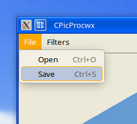

# Usage

`Open` file picker


`Browse` image in files an `Open Image`


Apply `Filters` to image

*only one filter at a time can be applied (for now)*


`Save` image



`Browse` save directory and choose filename


# Compiling from source

## Dependencies

### wxWidgets

archlinux:
  `gcc`,
  `make`,
  `wxwidgets-common`,
  `wxwidgets-gtk3`

## Compiling

linux:
```
$ make
```
You can use `-j <num>` for multithread compiling


# Static compiling from source
(Mostly) Portable executable

## Building wxWidgets for static binary

Download [wxWidgets 3.2.6 source code](https://github.com/wxWidgets/wxWidgets/releases/tag/v3.2.6)

### Cmake config
- Disable wxBUILD_SHARED
- Enable wxUSE_STATIC_RUNTIME

(via GUI or 
  `cmake <source> -D<conf>(=on|off) -B <build>`)

On build directory
```
$ cmake --build .
```
You can use `--parallel -j <num>` multithread compiling

### Modify Makefile
Change the `Makefile` `ST_WX_CONFIG` to your compiled
`wx-config` file

### Compile statically
```
$ make static
```


# Others

clean:
```
$ make clean
```