# Proceso Digital de Imagenes

Código fuente: [GitHub](https://github.com/Santi24Yt/wxcpicproc)

[App (linux)](https://github.com/Santi24Yt/wxcpicproc/releases/latest)

---------------------

## Tarea 1

- Componente RGB (mica)

Filters > Channels > RGB

[Función](https://github.com/Santi24Yt/wxcpicproc/blob/15cdf6e72c51f5620ae3a33739d39366522fa616/libs/image/filters/common.cpp#L79)

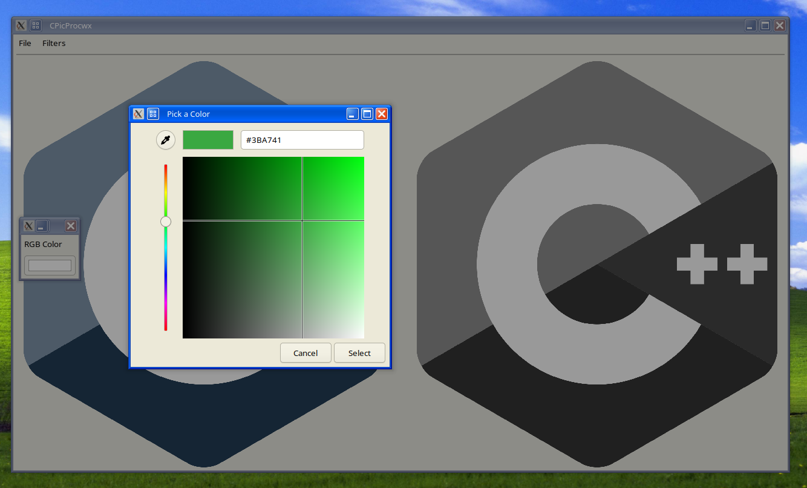
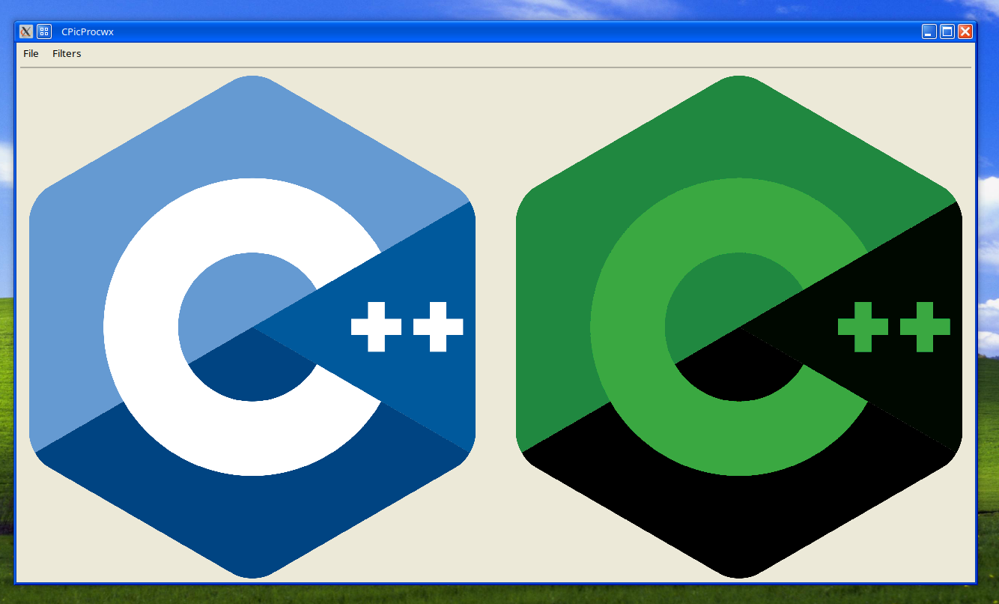

- Mosaico

Filters > Mosaic

[Función](https://github.com/Santi24Yt/wxcpicproc/blob/15cdf6e72c51f5620ae3a33739d39366522fa616/libs/image/filters/common.cpp#L138)

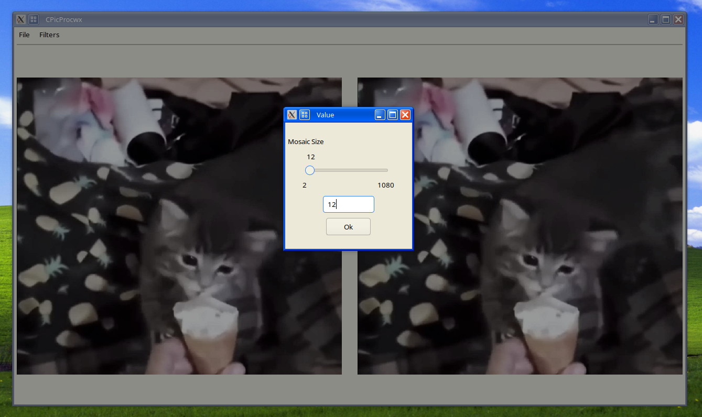
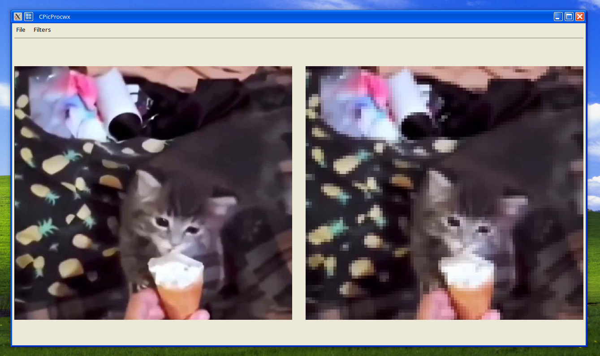

- Color a tono de gris
  - `(R+G+B)/3`

    Filters > Grayscale > Average

  [Función](https://github.com/Santi24Yt/wxcpicproc/blob/15cdf6e72c51f5620ae3a33739d39366522fa616/libs/image/filters/common.cpp#L98)

  

  - `R*0.299 + G*0.587 + B*0.114` [valores LUMA](https://en.wikipedia.org/wiki/Grayscale#Luma_coding_in_video_systems)

    Filters > Grayscale > Perceptual

  [Función](https://github.com/Santi24Yt/wxcpicproc/blob/15cdf6e72c51f5620ae3a33739d39366522fa616/libs/image/filters/common.cpp#L118)

  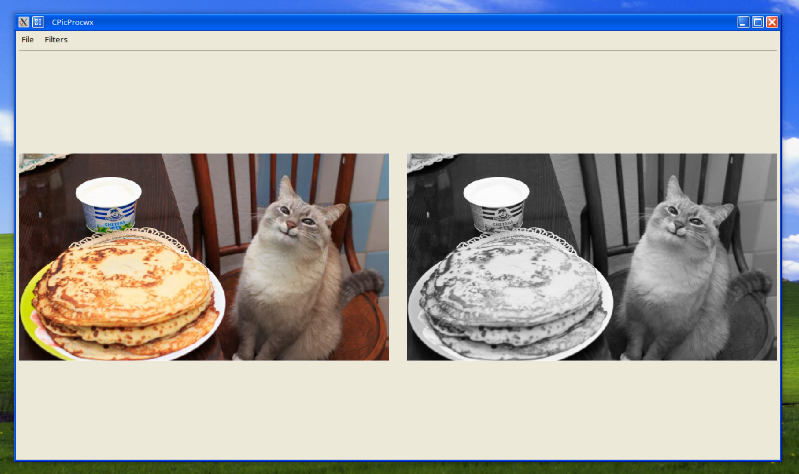

Comparación (bajón de calidad por compresión de gif)

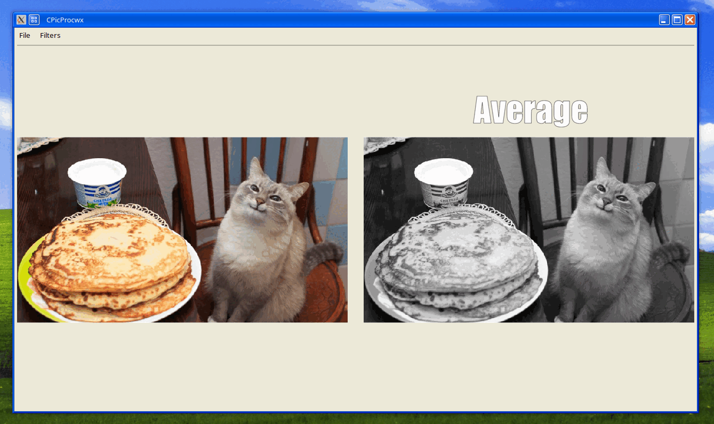

- Alto contraste

Filters > Contrast > High Contrast

[Función](https://github.com/Santi24Yt/wxcpicproc/blob/15cdf6e72c51f5620ae3a33739d39366522fa616/libs/image/filters/common.cpp#L193)  con valor `128` (mitad)

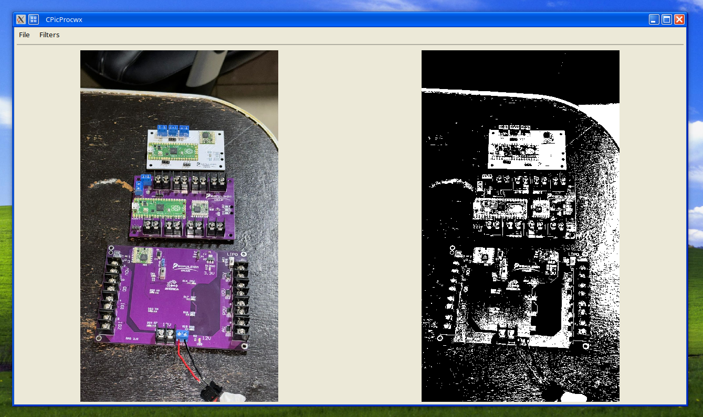

- Inverso del Alto contraste (negativo)

Filters > Contrast > Negative

*Misma función pero con la opción de invertido activada*

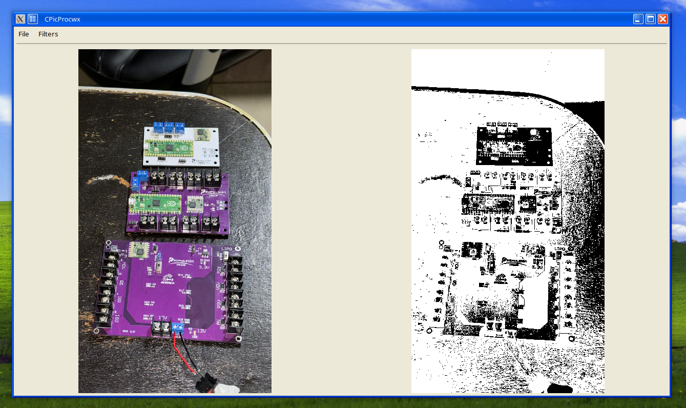

- Rojo, Verde, Azul, Alpha (extra)

Filters > Channels > Red/Green/Blue/Alpha

  - Rojo

  [Función](https://github.com/Santi24Yt/wxcpicproc/blob/15cdf6e72c51f5620ae3a33739d39366522fa616/libs/image/filters/common.cpp#L3)

  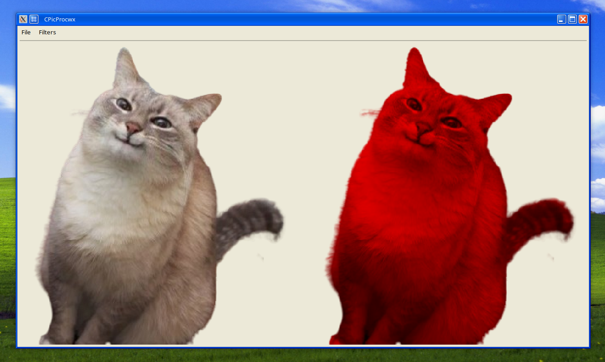

  - Verde

  [Función](https://github.com/Santi24Yt/wxcpicproc/blob/15cdf6e72c51f5620ae3a33739d39366522fa616/libs/image/filters/common.cpp#L22)

  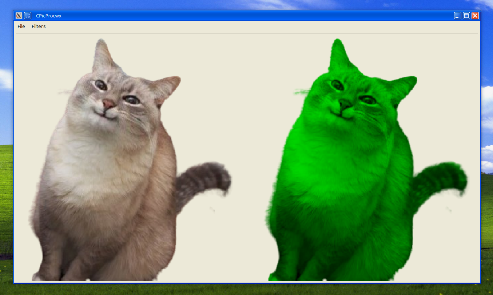

  - Azul

  [Función](https://github.com/Santi24Yt/wxcpicproc/blob/15cdf6e72c51f5620ae3a33739d39366522fa616/libs/image/filters/common.cpp#L41)

  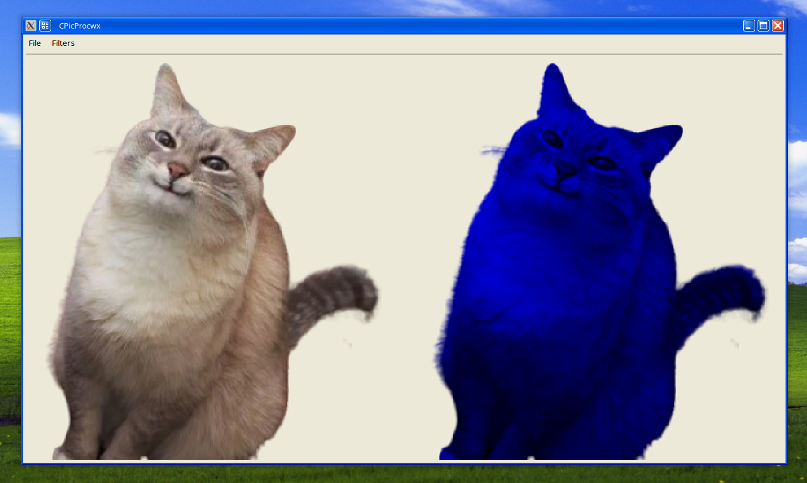

  - Alpha (extra)

  [Función](https://github.com/Santi24Yt/wxcpicproc/blob/15cdf6e72c51f5620ae3a33739d39366522fa616/libs/image/filters/common.cpp#L60)

  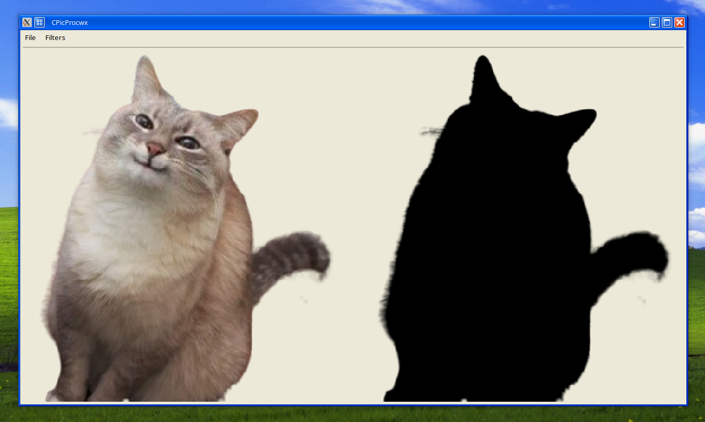

- Brillo (sumar/restar)

Filters > Brightness

[Función](https://github.com/Santi24Yt/wxcpicproc/blob/15cdf6e72c51f5620ae3a33739d39366522fa616/libs/image/filters/common.cpp#L226)

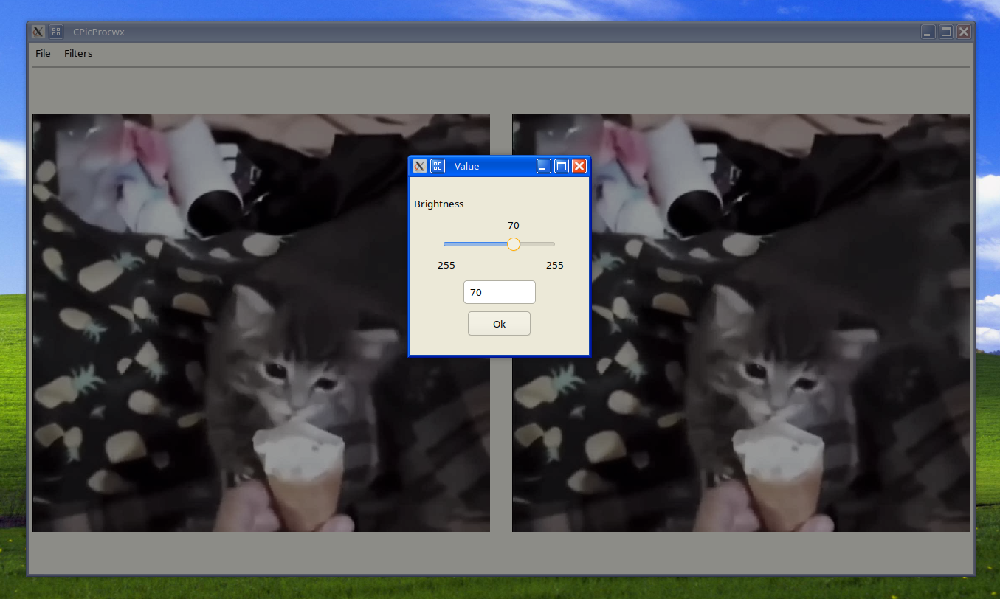
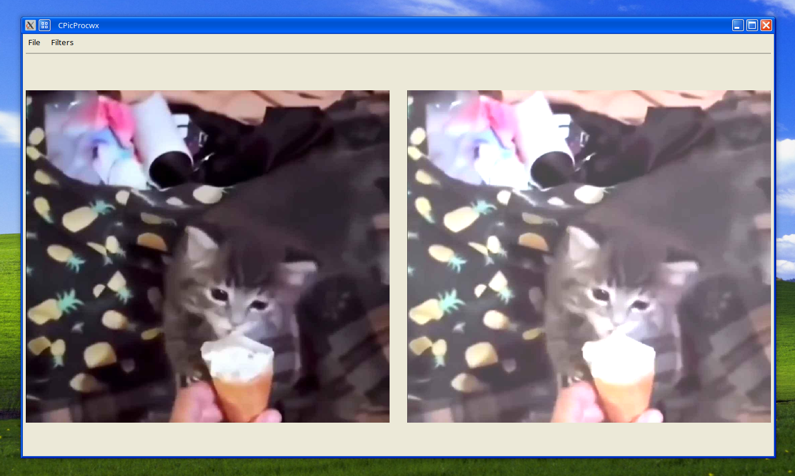
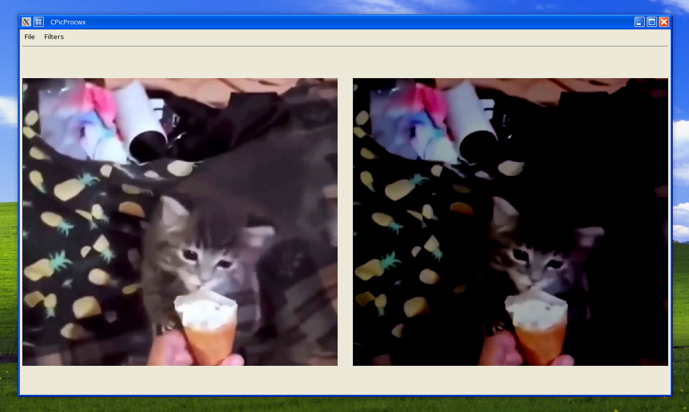